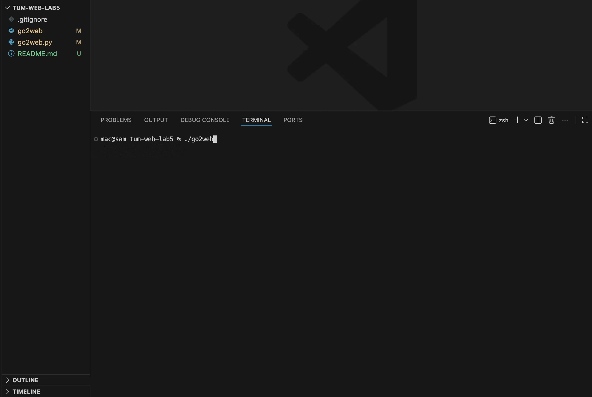
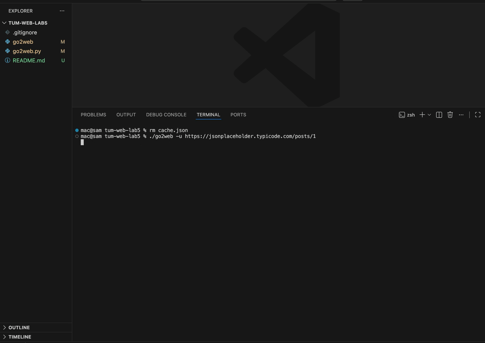

# go2web

A command-line HTTP client written in Python using only the standard library. Fetches URLs and searches the web directly from your terminal over raw TCP sockets — no `requests`, no `urllib`.

## Requirements

- Python 3.x (no third-party dependencies)

## Usage

```bash
# Show help
./go2web -h

# Fetch a URL and print human-readable content
./go2web -u https://example.com

# Search the web and pick a result to read
./go2web -s "python socket programming"
```

## Features

- **Raw TCP sockets** — HTTP/1.1 requests built and sent by hand using `socket` and `ssl`
- **HTTP redirects** — automatically follows 301, 302, 303, 307, 308 status codes as well as JS and meta-refresh redirects
- **HTTP caching** — responses cached in `cache.json` so repeated requests skip the network
- **Content negotiation** — detects `application/json` responses and pretty-prints them; strips HTML tags from `text/html` responses to show readable text
- **Search result navigation** — searches via DuckDuckGo, lists the top 10 results, and lets you fetch any one of them by number

## Demo

### -u and -h request, cache working

Shows `./go2web` with no args, `./go2web -h` for help, then `./go2web -u https://example.com` twice — first run shows `[cache miss] fetching from network`, second run shows `[cache hit] serving from cache`.



### -s request, accessing results

Shows `./go2web -s "python sockets"` returning the top 10 results from DuckDuckGo, then entering `3` to fetch and display that page in human-readable text.


### Fetching JSON and cache working

Shows `./go2web -u https://jsonplaceholder.typicode.com/posts/1` twice — first run fetches and pretty-prints the JSON response, second run serves it instantly from cache.


